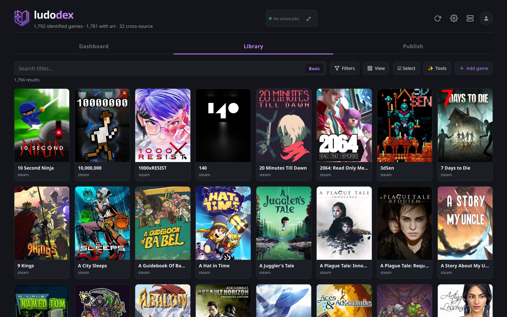

<div align="center">

# ludodex

**Every game you own. One library. Every platform.**

*ludo* (game) + *-dex* (index)

[](LICENSE)
[](DATA-LICENSE.md)
[](docs/DOCKER.md)

<!-- HERO SHOT — uncomment once docs/images/library.png exists.
     The library grid, ~1400px wide, dark theme, no browser chrome, real box art.

-->

</div>

---

Your games are scattered. Some on Steam, some on GOG, a shelf of cartridges, a NAS full
of ROMs, and a few you own three times over without realising it. Every storefront shows
you its own slice and none of them show you the whole.

**ludodex is one local catalog of everything you own** — emulation ROMs and digital
storefronts, deduped into a single library, with one entry per game *and platform*, so
"I own Rayman on PS1 and Steam" is a fact you can see and act on rather than something
you half-remember.

It runs on your own hardware. Nothing leaves it.

## What it actually does

### Knows what a file *is*

A folder of `Rayman (USA) (Rev A).bin` becomes a game with the right title, year,
platform, box art and genre — matched against real catalogs, not filename guesses.
Ambiguous matches are **refused** rather than guessed at, because a confident wrong
answer propagates into your art, your metadata, and eventually onto your devices.

<!-- IMAGE: docs/images/detail.png — a game detail page, matched providers + media -->

### Fixes itself in one click

One "make this correct" action re-checks identity, associations, media and contamination
together — because a wrong match and wrong art are the same bug wearing two hats.

<!-- IMAGE/GIF: docs/images/wand.gif — the wand correcting a badly-matched game -->

### One entry per game *and* platform

Not one row per title. *Sonic 2* on Genesis and *Sonic 2* on Game Gear are different
games that happen to share a name, and treating them as one is how libraries end up with
a Genesis game wearing Game Gear box art.

<!-- IMAGE: docs/images/platforms.png — the same game across several platforms -->

<!-- LAYOUT NOTE: once the images above exist, these three sections are designed to
     become a two-column table — text left, image right, alternating sides. Keeping
     them as plain sections until then avoids shipping empty cells or broken-image
     icons. See docs/images/README.md for what each shot should contain. -->

### And the rest

- **Ownership that reflects reality** — physical discs, digital licences, and "I want
  this on Switch" all tracked per format, so the library knows the difference between
  owning a game and owning *this copy* of it.
- **Artwork, automatically** — covers, logos, heroes, backgrounds and screenshots
  picked per game by a ranking that prefers the right shape, the right language and the
  right resolution, and demotes filler.
- **Frontend interop** — imports from and exports to Playnite and LaunchBox, metadata
  *and* media, without clobbering your hand-curated art.
- **Publishing to devices** — rules pick a slice of the library for a handheld or a
  cabinet, a plan says exactly what would be copied and converted, and applying it
  writes the files, the art and the gamelist in that target's own layout, recording
  every result in an install ledger.
- **Offline identity** — an optional prebuilt index resolves a store id, a title or a
  ROM hash to every other identifier for the same game, locally, in under a millisecond.

## Quick start

```bash
git clone https://github.com/datbird/ludodex.git && cd ludodex
cp .env.example .env          # every key is optional; add them from the UI instead
docker compose up -d
```

Open **<http://localhost:8001>** and add your sources from **Settings**. That's it —
no keys required to start, and every provider is opt-in.

Prefer to run it without Docker, or want the volume layout for a NAS?
See **[Running ludodex](docs/DOCKER.md)**.

## Under the hood

<!-- DIAGRAM: replace with a rendered architecture image when one exists.
     docs/PIPELINE.md carries the detailed version. -->

```
   storefronts ─┐
   ROM archives ─┼──▶  ingest  ──▶  identity  ──▶  enrich  ──▶  library
   frontends ────┘              (acceptance gate)   (metadata + art)
```

Everything is SQLite on your disk. The server is FastAPI, the UI is React, and the whole
thing is one container.

| | |
|---|---|
| **[How it works](docs/PIPELINE.md)** | The full pipeline: crawl → identify → enrich → media |
| **[Sources & providers](docs/SOURCES.md)** | Storefronts, ROM archives, local mounts, metadata and media providers |
| **[Database schema](docs/SCHEMA.md)** | Tables, what each column means, and queries worth stealing |
| **[Frontends](docs/FRONTENDS.md)** | Playnite and LaunchBox, both directions, metadata and art |
| **[Credentials](docs/AUTH.md)** | Every integration, what it needs, and how to get it |
| **[Configuration](docs/CONFIG.md)** | Config keys and behaviour preferences |
| **[Backing store](docs/SYNC.md)** | Two-way sync of your durable data with PocketBase, Postgres, Supabase, MySQL or Firestore |
| **[Running in Docker](docs/DOCKER.md)** | Volumes, media storage, shares, upgrades |
| **[Design & roadmap](docs/DESIGN.md)** | Where this is going, and why it's built this way |

## Status

Actively developed and in daily use against a library of ~570,000 ROM files and several
thousand storefront titles. The catalog, matching, media pipeline, ownership model and
frontend interop are all in production use — as is **device publishing**: pushing a
curated selection to a handheld or cabinet with the right formats, metadata and art for
that target, via publish rules → plan → apply and an install ledger (the **Publish** tab,
`/api/devices/{id}/publish/*`, `ludodex/publish*.py`).

## Privacy

Your library never leaves your machine. Catalogs, ownership dumps and cached auth tokens
are all gitignored; nothing personal is committed, and there is no telemetry, no account,
and no phone-home.

## License

**Code is [MIT](LICENSE).** Game data is not, and none of it ships here — a clone gives
you code, not a catalog. ludodex fetches with credentials *you* supply, so the providers'
terms apply to what you fetch.

The one thing worth reading before forking commercially: the optional prebuilt **match
index** derives from ScreenScraper's database and is therefore **CC BY-NC-SA 4.0**.
MIT lets you sell a fork of this code; it does not let you ship or sell that index with
it. Building your own locally is unaffected.

Full breakdown: **[DATA-LICENSE.md](DATA-LICENSE.md)**.
