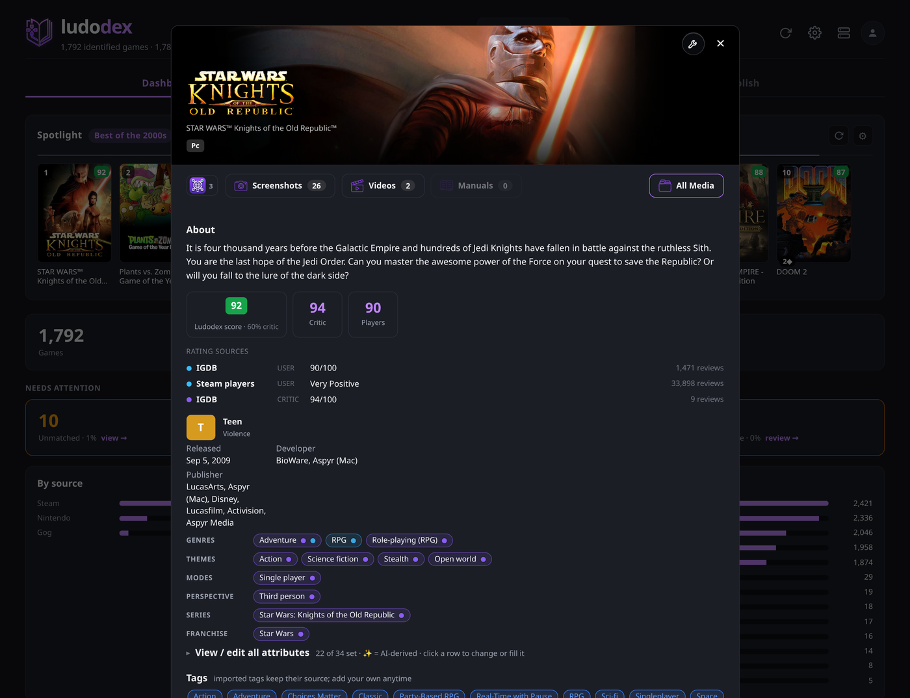
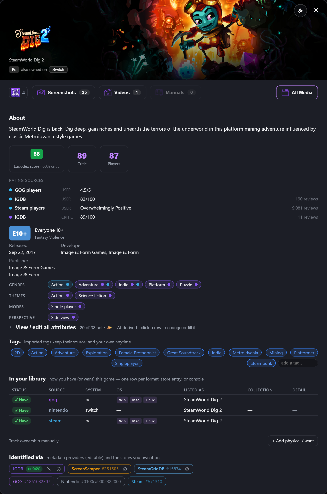
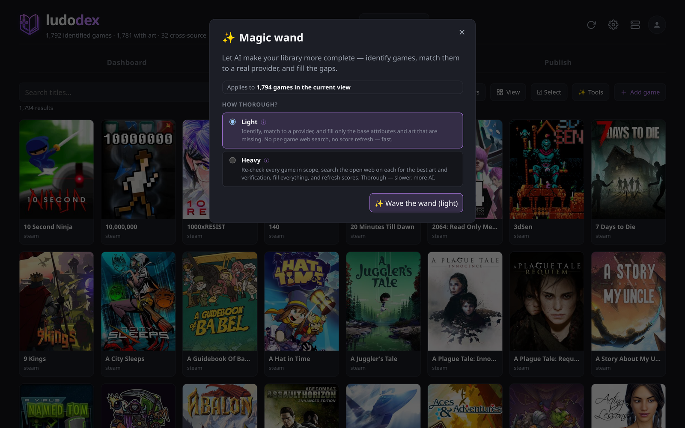
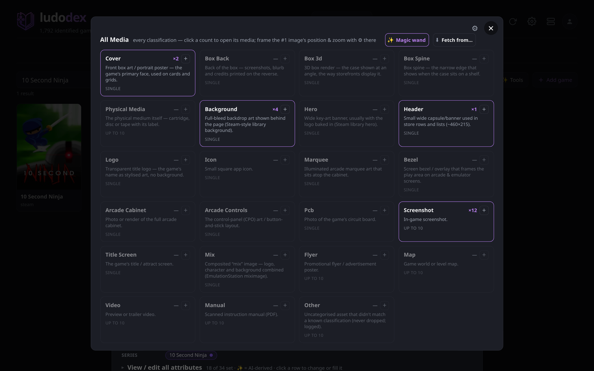
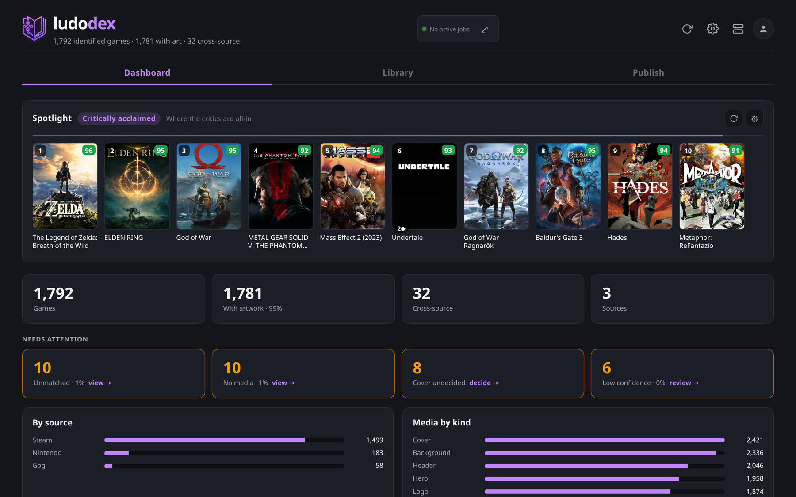

<div align="center">


**Every game you own. One library. Every platform.**

*ludo* (game) + *-dex* (index)

[](LICENSE)
[](DATA-LICENSE.md)
[](docs/DOCKER.md)


</div>

---

Every library tool builds its own catalog. Playnite, LaunchBox, ES-DE, RetroBat and the
rest each scrape their own metadata, pick their own art, and get their own matches wrong.
Fix a bad cover in one and the others still show it. Set up a second device and you sit
through the whole scrape again.

**ludodex sits above them rather than competing with them.** It holds the one catalog you
correct, and then pushes that correction outward to everything you run: the ROM where
that frontend expects it, the metadata it reads, and the art it displays, each in its own
layout. Fix a game once, here, and it is fixed on the handheld, in the cabinet, and in
every frontend on every machine. You stop re-scraping, and you stop fixing the same game
five times.

Everything you own lives in it, ROMs and storefronts alike, deduped into one library with
**one card per game** and every platform and edition you own listed on it. AI helps when a
match is genuinely hard, and it is optional. The rest works without it.

It runs on your own hardware. Nothing leaves it.

## What it actually does

### Knows what a file *is*

A folder of `Rayman (USA) (Rev A).bin` becomes a game with the right title, year,
platform, box art and genre, matched against real catalogs rather than filename guesses.
Ambiguous matches are **refused** rather than guessed at, because a confident wrong
answer propagates into your art, your metadata, and eventually onto your devices.

Every game shows you what it matched, which provider each fact came from, and which
of its 33 attributes are still empty.

<div align="center">

</div>

### One card per game

Own *SteamWorld Dig 2* on Steam, on GOG and on Switch and you get one card, not three. It
tells you which platforms you have it on and lists every copy underneath. The axis that
folds is the PLATFORM, and only that: a remaster, a remake and a sequel are different
products and each keeps its own card, so *Dark Souls*, *Dark Souls: Remastered* and
*Dark Souls II* sit side by side rather than hiding inside one another. What the fold no
longer merges, the detail page still shows, under Other versions and Series.

Underneath, every platform is still its own record. That is what lets a Switch copy show
Switch art instead of Steam art, and what lets you publish one platform's files to a
handheld without dragging the others along. You see the game; the machine still sees
each copy.

<div align="center">

</div>


### Fixes itself in one click

One "make this correct" action re-checks identity, associations, media and contamination
together, because a wrong match and wrong art are the same bug wearing two hats. Point it
at one game or at everything in the current view. It tells you the scope before it runs.

<div align="center">

</div>

### Artwork, deliberately

Covers, logos, heroes, backgrounds, marquees, bezels, screenshots and more, each a
classification ludodex understands rather than a folder of loose files. Art is picked per
game by a ranking that prefers the right shape, the right language and the right
resolution, and demotes filler.

<div align="center">

</div>

### And the rest

- **Ownership that reflects reality.** Physical discs, digital licences, and "I want this
  on Switch" all tracked per format, so the library knows the difference between owning a
  game and owning *this copy* of it.
- **A dashboard that points at work.** What came in recently, what is missing art, what
  matched badly, and a rotating spotlight through your own collection.
- **Frontend interop.** Imports from and exports to Playnite and LaunchBox, metadata *and*
  media, without clobbering your hand-curated art.
- **Publishing to devices.** Rules pick a slice of the library for a handheld or a
  cabinet, a plan says exactly what would be copied and converted, and applying it writes
  the files, the art and the gamelist in that target's own layout, recording every result
  in an install ledger.
- **Offline identity.** An optional prebuilt index resolves a store id, a title or a ROM
  hash to every other identifier for the same game, locally, in under a millisecond.

<div align="center">

</div>

## Quick start

```bash
git clone https://github.com/datbird/ludodex.git && cd ludodex
cp .env.example .env          # every key is optional; add them from the UI instead
docker compose up -d
```

Open **<http://localhost:8001>** and add your sources from **Settings**. That is it. No
keys are required to start, and every provider is opt-in.

Prefer to run it without Docker, or want the volume layout for a NAS?
See **[Running ludodex](docs/DOCKER.md)**.

## Under the hood

```
   storefronts ─┐
   ROM archives ─┼──▶  ingest  ──▶  identity  ──▶  enrich  ──▶  library
   frontends ────┘              (acceptance gate)   (metadata + art)
```

Everything is SQLite on your disk. The server is FastAPI, the UI is React, and the whole
thing is one container.

| | |
|---|---|
| **[How it works](docs/PIPELINE.md)** | The full pipeline: crawl, identify, enrich, media |
| **[Sources & providers](docs/SOURCES.md)** | Storefronts, ROM archives, local mounts, metadata and media providers |
| **[Database schema](docs/SCHEMA.md)** | Tables, what each column means, and queries worth stealing |
| **[Frontends](docs/FRONTENDS.md)** | Playnite and LaunchBox, both directions, metadata and art |
| **[Credentials](docs/AUTH.md)** | Every integration, what it needs, and how to get it |
| **[Configuration](docs/CONFIG.md)** | Config keys and behaviour preferences |
| **[Backing store](docs/SYNC.md)** | Two-way sync of your durable data with PocketBase, Postgres, Supabase, MySQL or Firestore |
| **[Running in Docker](docs/DOCKER.md)** | Volumes, media storage, shares, upgrades |
| **[Design & roadmap](docs/DESIGN.md)** | Where this is going, and why it is built this way |
| **[Testing](docs/TESTING.md)** | The offline suite, plus the contract and browser tests that catch what unit tests cannot |

## Status

Actively developed and in daily use against a library of ~570,000 ROM files and several
thousand storefront titles. The catalog, matching, media pipeline, ownership model and
frontend interop are all in production use, as is **device publishing**: pushing a curated
selection to a handheld or cabinet with the right formats, metadata and art for that
target, via publish rules, plan, apply and an install ledger (the **Publish** tab,
`/api/devices/{id}/publish/*`, `ludodex/publish*.py`).

## Privacy

Your library never leaves your machine. Catalogs, ownership dumps and cached auth tokens
are all gitignored. Nothing personal is committed, and there is no telemetry, no account,
and no phone-home.

## License

**Code is [MIT](LICENSE).** Game data is not, and none of it ships here, so a clone gives
you code rather than a catalog. ludodex fetches with credentials *you* supply, so the
providers' terms apply to what you fetch.

The one thing worth reading before forking commercially: the optional prebuilt **match
index** derives from ScreenScraper's database and is therefore **CC BY-NC-SA 4.0**.
MIT lets you sell a fork of this code. It does not let you ship or sell that index with
it. Building your own locally is unaffected.

Full breakdown: **[DATA-LICENSE.md](DATA-LICENSE.md)**.
